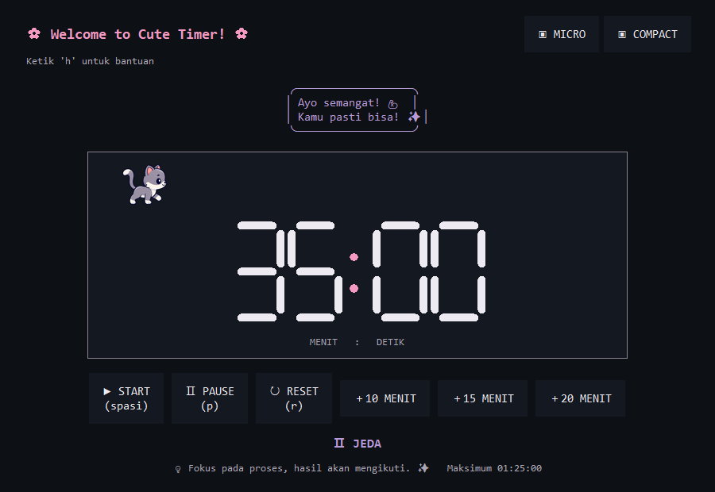

# Panduan Pengguna Cute Timer

Cute Timer membantu Anda mengatur waktu belajar atau bekerja dari desktop Windows. Anda bisa memilih tampilan besar, ringkas, atau paling kecil tanpa menghentikan hitungan waktu.

## Mulai dalam 1 menit

1. Klik dua kali shortcut **Cute Timer** di Desktop.
2. Klik **+10 MENIT**, **+15 MENIT**, atau **+20 MENIT**.
3. Klik **START** untuk memulai hitungan mundur.
4. Klik **PAUSE** jika ingin berhenti sejenak.
5. Klik **RESET** untuk menghapus waktu dan kembali ke `00:00`.

Timer tidak akan berjalan sebelum Anda menambahkan waktu. Durasi paling lama adalah 1 jam 25 menit.

## Tampilan Full

Tampilan Full memuat seluruh kontrol. Angka besar menunjukkan sisa waktu, sedangkan kucing berjalan menjadi hiasan.

- **START** memulai hitungan mundur.
- **PAUSE** menghentikan hitungan sementara.
- **RESET** mengembalikan waktu ke `00:00`.
- **+10 MENIT**, **+15 MENIT**, dan **+20 MENIT** menambah durasi.
- **MICRO** dan **COMPACT** mengganti ukuran tampilan.

Status yang tersedia: **SIAP**, **BERJALAN**, **JEDA**, dan **FINISH**.

## Tampilan Compact

Compact hanya menunjukkan sisa waktu dan kucing. Jendela ini tetap berada di atas aplikasi lain.

- Klik **COMPACT** dari Full.
- Klik dua kali pada timer untuk menjeda atau melanjutkan.
- Klik tiga kali sisi kiri untuk mengurangi 10 menit.
- Klik tiga kali sisi kanan untuk menambah 10 menit.
- Besarkan jendela untuk kembali ke Full.

Tulisan `STOP`, `PLAY`, `−10`, atau `+10` muncul sebentar setelah aksi berhasil.

## Tampilan Micro

Micro adalah tampilan paling kecil. Anda akan melihat tombol `×`, pegangan titik-titik, sisa waktu, dan kucing di dalam roda. Jendela ini tanpa bilah judul dan tetap berada di atas aplikasi lain.

- Klik **MICRO** dari Full, atau tekan `M`.
- Tarik pegangan titik-titik untuk memindahkan timer.
- Klik `×` atau tekan `M` untuk kembali ke Compact.
- Klik dua kali timer untuk menjeda atau melanjutkan.
- Klik tiga kali sisi kiri atau kanan untuk mengurangi atau menambah 10 menit.

## Shortcut keyboard

Klik jendela Cute Timer lebih dahulu, lalu gunakan tombol berikut.

| Tombol | Fungsi |
|---|---|
| `Space` | Memulai timer |
| `P` | Menjeda timer |
| `R` | Menghapus waktu dan kembali ke `00:00` |
| `A` | Membuka menu tambah waktu |
| `1` | Menambah 10 menit |
| `2` | Menambah 15 menit |
| `3` | Menambah 20 menit |
| `M` | Membuka Micro atau kembali ke Compact |
| `H` | Membuka bantuan |
| `Q` | Menutup Cute Timer |

## Saat waktu habis

Timer berhenti di `00:00` dan Windows membunyikan suara selesai. Full menunjukkan status **FINISH**. Compact menampilkan animasi kucing dan percikan kecil untuk sementara.

## Jika timer terasa tidak bekerja

- **START tidak bereaksi:** tambahkan waktu terlebih dahulu.
- **Tampilan terlalu kecil:** tekan `M` atau klik `×`, lalu besarkan jendela untuk membuka Full.
- **Shortcut tidak bereaksi:** klik jendela Cute Timer, lalu tekan shortcut lagi.
- **Suara selesai tidak terdengar:** periksa volume Windows.

Untuk membuka aplikasi tanpa shortcut Desktop, ketik `timer` melalui terminal Windows setelah Cute Timer dipasang.
